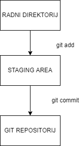
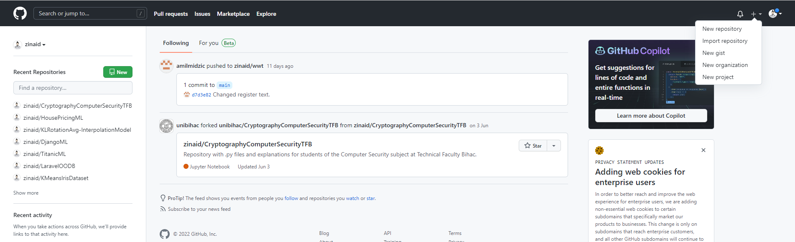
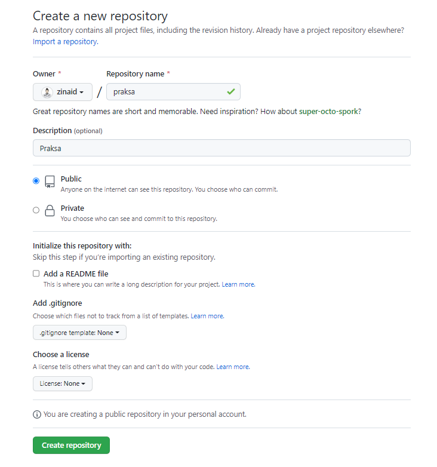
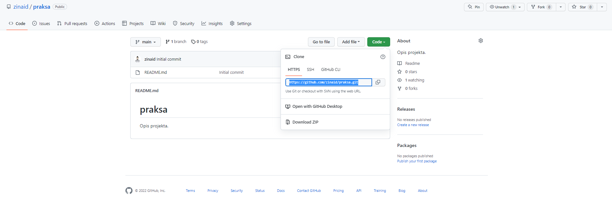
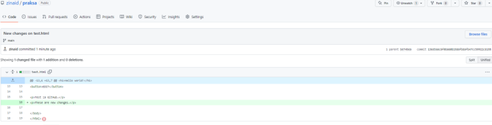
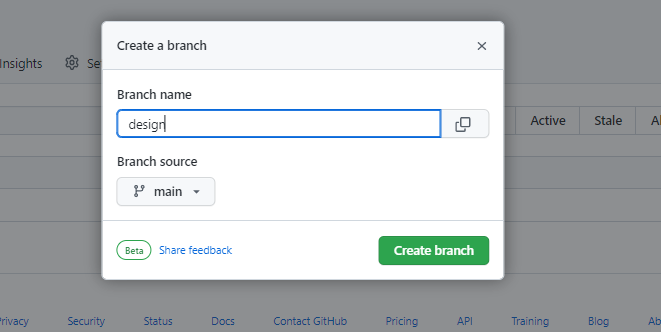
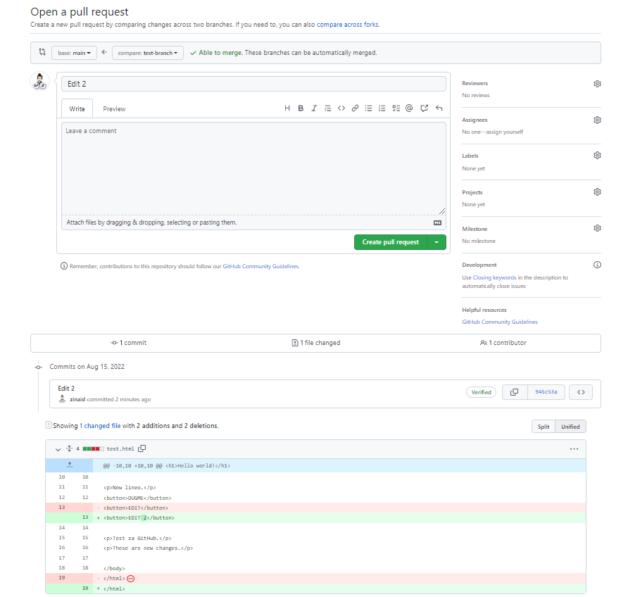
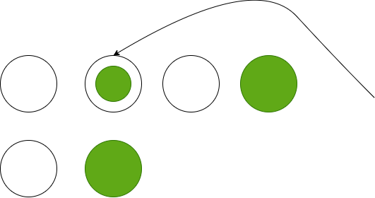

# <div style="text-align:center"> GIT TUTORIJAL</div>

## SADRŽAJ
* ### GIT
  * <a href="#info">Osnovne informacije</a>
  * <a href="#installation">Instalacija</a> 
  * <a href="#configuration">Konfiguracija</a>
  * <a href="#initialization">Inicijalizacija i Workflow</a>
  * <a href="#staging">Staging okruženje</a>
  * <a href="#commit">Git Commit</a>
  * <a href="#help">Git Help</a>
  * <a href="#branch">Git Branch</a>
  * <a href="#merge">Git Merge</a>
* ### GITHUB
  * <a href="#github_info">Osnovne informacije</a>
  * <a href="#github_configuration">Stavljanje projekta na GitHub</a>
  * <a href="#github_pull">Git pull sa GitHuba</a>
  * <a href="#github_fetch">Git Fetch sa GitHuba</a>
  * <a href="#github_merge">Git Merge sa GitHuba</a>
  * <a href="#github_push">Git Push sa GitHubom</a>
  * <a href="#github_workflow">Git i GitHub Workflow</a>
* ### GITIGNORE
  * <a href="#gitignore">Gitignore</a>
* ### GIT UNDO OPERACIJE
  * <a href="#git_revert">Git revert</a>
  * <a href="#git_reset">Git reset</a>
  * <a href="#git_ammend">Git ammend</a>


### <div id="info">Git je sistem za kontrolu verzija projekta. Git olakšava praćenje promjena u kodu kao i kolaboraciju između programera.</div>

### Git se koristi za:

* Upravljanje projektima kroz repozitorije
* Kloniranje projekata za rad na lokalu
* Kontroliranje i praćenje promjena sa Staging i Commiting
* Kreiranje grana i spajanje/Merge istih što omogućuje rad na različitim dijelovima i verzijama projekta
* Povlačenje/Pull zadnje verzije projekta na lokalnu kopiju
* Slanje/Push lokalnih promjena na main projekt

### Proces rada sa gitom:
* Inicijalizacija git-a na folder čineći ga repositorijem
* Git sada kreira skriveni folder za praćenje promjena u tom folderu
* Kad je fajl modifikovan, dodan ili obrisan, to se smatra modifikacijom
* Biramo modificirane fajlove koje želimo poslati na Stage
* Fajlovi na Stagu su Commited, što navodi Git da spremi trajnu snimku datoteka
* Git omogućuje praćenje cijele historije svakog commita
* Moguće je vratiti na bilo koji prošli commit
* Git ne čuva odvojenu kopiju svakog fajla u svakom commit-u ali prati promjene urađene u svakom commitu

### Zašto Git:
Preko 70% developera koristi Git što im omogućuje da rade zajedno sa raznih mjesta u svijetu. Developeri mogu vidjeti punu historiju projekta i mogu se vraćati na prijašnje verzije.

### Šta je Github?
Github nije isto što i Git. Github pravi alate koji koriste Git. Github je najveći host source kodova u svijetu.

## <div id="installation">INSTALACIJA</div>

Download link: 
 https://www.git-scm.com/

 Poslije instalacije možemo provjeriti verziju Git-a komandom:

```
git --version
```
koja će vratiti npr.
```
git version 2.37.0.windows.1
```

## <div id="configuration">KONFIGURACIJA GIT-a</div>

Postavke Git-a uključuju definiranje korisničkog imena i email adrese sa naredbama:

```
git config --global user.name "test"
git config --global user.email "test@test.com"
```
Ako izostavimo komandu global definiramo korisničko ime i email adresu samo za određeni repozitorij.

Napravimo sada jedan folder za naš projekt

```
mkdir test
cd test
```

## <div id="initialization">INICIJALIZACIJA GIT-a</div>

Za folder u kojem radimo inicijaliziramo Git sa

```
git init
```
Na taj način kreirali smo prvi Git repozitorij, a koji je trenutno prazan. Recimo da sada dodamo novi fajl test.html u ovaj folder koji sadrži sljedeći kod:

```
<!DOCTYPE html>
<html>
<head>
<title>Hello World!</title>
</head>
<body>

<h1>Hello world!</h1>
<p>This is the first file in my new Git Repo.</p>

</body>
</html>
```

Naredbom ls provjeravamo sadržaj foldera
```
ls

    Directory: C:\Users\Korisnik\Desktop\Git


Mode                 LastWriteTime         Length Name
----                 -------------         ------ ----
-a----         8.8.2022.     13:19             26 .gitignore
-a----         8.8.2022.     13:16            173 test.html
-a----         8.8.2022.     13:16          28958 tutorial.html
-a----         8.8.2022.     13:16           2422 tutorial.md
```

Da bi provjerili status Git-a i vidjeli šta se to dešava u našem repozitoriju koristimo

```
git status

PS C:\Users\Korisnik\Desktop\Git> git status
On branch master

No commits yet

Untracked files:
  (use "git add <file>..." to include in what will be committed)
        .gitignore
        test.html

nothing added to commit but untracked files present (use "git add" to track)
```

Kao što vidimo kreirali smo i fajl .gitignore o kojem će biti govora kasnije, ali najbitnije je da se zna da u tom fajlu definiramo sve ono što želimo da Git ignorira kao što su npr.logovi, neki cache fajlovi i sl.

Iz prethodnog rezultata naredbe git status vidimo da Git zna sadržaj našeg foldera, ali isto tako da ništa nije dodano u naš repozitorij.

Fajlovi u Git repozitoriju mogu biti u jednom od 2 stanja, a to su:

* Tracked - fajlovi za koje Git zna i koji su dodani u repozitorij
* Untracked - fajlovi koji su u radnom direktoriju, ali nisu dodani u repozitorij

Kada fajlove prvi put dodamo u prazan repozitorij oni su svi nepraćeni/untracked. Da bi ih Git pratio potrebno ih je dodati u Staging okruženje. U Staging okruženje se dodaje naredbom ```git add``` a iz Staging okruženja u repositorij se dodaju sa ```git commit```. Poslije ```push``` operacije fajlovi su trajno spremljeni na git repozitorij.

<div style="text-align:center">
   
</div>

## <div id="staging">GIT STAGING OKRUŽENJE</div>
Osnovni dio funkcionisanja Git-a je koncept Staging okruženja i Commit. 

Npr. dok radimo moguće je dodavati, editovati i brisati fajlove. Ali dok odradimo neki dio posla, potrebno je dodati fajlove u Staging okruženje.

Staged fajlovi su fajlovi koji su spremni da se komitaju u repozitorij u kojem radimo.

Da bi fajl test.html dodali u Staging okruženje koristimo:

```
git add test.html
```

Sada nakon provjeravanja satusa imamo sljedeće

```
git status       
On branch master

No commits yet

Changes to be committed:
  (use "git rm --cached <file>..." to unstage)
        new file:   test.html

Untracked files:
  (use "git add <file>..." to include in what will be committed)
        .gitignore
```

Vidimo da je fajl test.html trenutno spreman da bude commited. Više fajlova koji su modified je moguće dodati koristeći
```
git add --all ili git add -A
```

## <div id="commit">GIT COMMIT</div>

Sljedeći korak je pomjeriti fajlove iz stage u commit za naš repozitorij. Dodavanjem commit-a pratimo naš progres jer Git posmatra svaki commit kao "Save point". To je tačka kojoj se možemo vratiti ukoliko želimo. Kad radimo commit treba koristiti poruke. Stavljanjem jasne poruke u commit olakšavamo i sebi i drugim programerima.

```
git commit -m "First commit"

[master (root-commit) a8dfc6d] First commit
 1 file changed, 12 insertions(+)
 create mode 100644 test.html
```

Sada kad uradimo update fajla test.html-a na sljedeci način

```
<!DOCTYPE html>
<html>
<head>
<title>Hello World!</title>
</head>
<body>

<h1>Hello world!</h1>
<p>This is the first file in my new Git Repo.</p>
<p>New lineo.</p>

</body>
</html>
```

i provjerimo status repozitorija dobijemo sljedeće

```
PS C:\Users\Korisnik\Desktop\Git> git status --short
 M test.html
?? .gitignore
```

Moguće zastavice su:

```
?? - Untracked files
A - Files added to stage
M - Modified files
D - Deleted files
```

Dakle vidjeli smo da je naš fajl test.html modifikovan i potrebno je commitati tu promjenu

```
PS C:\Users\Korisnik\Desktop\Git> git commit -a -m "Updated test.html with a new line"
[master a3cd8e4] Updated test.html with a new line
 1 file changed, 1 insertion(+)
```

Da bi vidjeli log commit-a koristimo komandu

```

PS C:\Users\Korisnik\Desktop\Git> git log
commit a3cd8e4ecef9d1141b3aa3be35da422fb72d4f41 (HEAD -> master)
Author: Zinaid Kapić <zinaid_kapic@hotmail.com>
Date:   Mon Aug 8 13:46:17 2022 +0200

    Updated test.html with a new line

commit a8dfc6d9bd5f173fb60df011c0458554e89692ea
Author: Zinaid Kapić <zinaid_kapic@hotmail.com>
:
```

## <div id="help">GIT HELP</div>

Korisna komanda je  ``` git command -help ili git help -all ``` na osnovu koje možemo dobiti informacije o nekoj specifičnoj komandi ili o svim komandama.

## <div id="branch">GIT BRANCH</div>

U Git-u, branch/grana je nova, odvojena verzija glavnog/main repozitorija. Recimo da radimo na velikom projektu i trebamo urediti dizajn. Cijeli taj proces sa i bez Git-a bi tekao ovako

Bez Git-a:

* Napravi kopije svih bitnih fajlova kako ne bi uticali na live verziju
* Počni raditi na dizajnu i shvati da taj kod zavisi od drugog koda u fajlovima koji isto treba mijenjati
* Napravi kopije tih novih fajlova, pri tome paziti da sve reference vode na tačan naziv kopiranih fajlova
* PROBLEM ! Javila se nepovezana greška negdje drugo i treba je odmah popraviti
* Spremimo sve naše fajlove i napravimo zabilješke naziva tih novih fajlova
* Popravimo grešku
* Vratimo se na dizajn i završimo ga
* Prebacimo kod ili preimenujemo fajlove tako da je naš dizajn sad na live verziji
* Nakon nekog vremena shvatimo da ona greška nije popravljena u novom dizajnu jer smo kopirali fajlove prije popravke

Sa Git-om:
* Napravimo novi branch naziva new-design i editujemo kod bez diranja glavnog brancha
* PROBLEM Javila se nepovezana greška negdje drugo i treba je odmah popraviti
* Napravimo novi branch iz našeg main projekta i nazovimo ga small-fix
* Ppravimo grešku i napravimo merge main-a i small-fix branchova
* Vratimo se nazad na new-design branch i završimo posao
* Uradimo merge new-design i main brancha (dobijamo alert za small-fix grešku koja nam nedostraje)

Branchovi nam dakle omogućuju da radimo na različitim dijelovima projekta a da ne utičemo na main branch. Kad se uradi posao branch se može mergati sa glavnim projektom. Moguće je i prebacivati se sa branca na branch i raditi na raznim projektima.

Dakle, radimo na našem lokalnom repozitoriju i ne želimo da ometamo ili eventualno razvalimo main projekt. Sljedeći korak kojeg uradimo je kreiranje novog brancha

```
git branch hello-world

PS C:\Users\Korisnik\Desktop\Git> git branch
  hello-world
* master
```
Zvjezdica znači da smo trenutno na master branch-u. Koristeći sljedeću komandu prebacujemo se na drugi branch

```
PS C:\Users\Korisnik\Desktop\Git> git checkout hello-world
Switched to branch 'hello-world'
```

Sada napravimo neke promjene u fajlu test.html i dodajmo novi fajl test2.txt.

```
<!DOCTYPE html>
<html>
<head>
<title>Hello World!</title>
</head>
<body>

<h1>Hello world!</h1>
<p>This is the first file in my new Git Repo.</p>
<p>New lineo.</p>
<button>DUGME</button>

</body>
</html>
```
Provjerimo Git status

```
PS C:\Users\Korisnik\Desktop\Git> git status
On branch hello-world
Changes not staged for commit:
  (use "git add <file>..." to update what will be committed)
  (use "git restore <file>..." to discard changes in working directory)
        modified:   test.html

Untracked files:
  (use "git add <file>..." to include in what will be committed)
        .gitignore
        test2.txt

no changes added to commit (use "git add" and/or "git commit -a")

```

Vidimo da se nalazimo na branchu hello-world i da ima promjena na test.html ali file nije staged za commit. Fajl test2.txt nije tracked. Dakle, potrebno je oba fajla dodati na Staging okruženje za ovaj branch:
```
git add --all

PS C:\Users\Korisnik\Desktop\Git> git status
On branch hello-world
Changes to be committed:
  (use "git restore --staged <file>..." to unstage)
        new file:   .gitignore
        modified:   test.html
        new file:   test2.txt
```
Vidimo da imamo tri promjene u stage-u za commit a o su novi fajlovi test2.txt fajl gitignore i modifikacija fajla test.html.

Te promjene commitamo sa
```
git commit -m "Dodani novi fajlovi i dugme."
```

Sada imamo novi branch koji je drugačiji od master brancha. Hajmo izlistati fajlove u ovom branchu
```
PS C:\Users\Korisnik\Desktop\Git> ls


    Directory: C:\Users\Korisnik\Desktop\Git


Mode                 LastWriteTime         Length Name
----                 -------------         ------ ----
-a----         8.8.2022.     13:19             26 .gitignore
-a----         8.8.2022.     14:20            216 test.html
-a----         8.8.2022.     14:22              0 test2.txt
-a----         8.8.2022.     14:32          38819 tutorial.html
-a----         8.8.2022.     14:32          10688 tutorial.md
```

Sada se prebacimo na master branch i izlistajmo fajlove

```
PS C:\Users\Korisnik\Desktop\Git> git checkout master
Switched to branch 'master'
PS C:\Users\Korisnik\Desktop\Git> ls


    Directory: C:\Users\Korisnik\Desktop\Git


Mode                 LastWriteTime         Length Name
----                 -------------         ------ ----
-a----         8.8.2022.     14:33            192 test.html
-a----         8.8.2022.     14:32          39413 tutorial.html
-a----         8.8.2022.     14:32          11253 tutorial.md
```

Vidimo da novi fajlovi nisu dio njega, a i kod u test.html ne sadrži dugme. Sada se vratimo pomenutom scenariju gdje se pojavi nepovezani error kojeg odmah treba popraviti. Kreirajmo novi branch i prebacimo se na njega

```
git checkout -b emergency-fix
Switched to a new branch 'emergency-fix'
```

Popravimo imaginarnu grešku, tako što ćemo npr izbrisati liniju u test.html.

```
git status
On branch emergency-fix
Changes not staged for commit:
  (use "git add <file>..." to update what will be committed)
  (use "git restore <file>..." to discard changes in working directory)
        modified:   test.html

Untracked files:
  (use "git add <file>..." to include in what will be committed)
        tutorial.html
        tutorial.md

no changes added to commit (use "git add" and/or "git commit -a")
```

Treba uraditi Stage fajla test.html i uraditi commit.
```
PS C:\Users\Korisnik\Desktop\Git> git add test.html
PS C:\Users\Korisnik\Desktop\Git> git commit -m "fixed small bug"
[emergency-fix e5b006e] fixed small bug
 1 file changed, 1 deletion(-)
```

Zasad je urađen fix koji je spreman za master-a i treba uraditi merge dva brancha emergancy-fix i master.

## <div id="merge">GIT BRANCH MERGE</div>

Dakle, popravili smo bug i imamo dva brancha emergancy fix i master. Potrebno je prebaciti se na master branch.

```
PS C:\Users\Korisnik\Desktop\Git> git checkout master
Switched to branch 'master'
```

Sada radimo merge trenutnog brancha (master) sa emergancy-fix.

```
git merge emergency-fix
Updating a3cd8e4..e5b006e
Fast-forward
 test.html | 1 -
 1 file changed, 1 deletion(-)
```
Budući da je branch emergency-fix došao izravno od mastera, a nisu napravljene nikakve druge promjene u masteru dok smo radili, Git ovo vidi kao nastavak mastera. Tako da može "Fast Forward", samo usmjeravajući i master i emergency-fix na isti commit.
Emergency-fix nam više ne treba pa se može obrisati.
```
PS C:\Users\Korisnik\Desktop\Git> git branch -d emergency-fix
Deleted branch emergency-fix (was e5b006e).
```

### MERGE CONFLICT

Prebacimo se sad na hello-world branch i dodajmo jos jedan fajl npr. test3.txt i izmjenimo test.html tako sto cemo dodati jos jedno dugme EDIT.

Sve to dodamo na stage i uradimo commit za ovaj branch.
```
PS C:\Users\Korisnik\Desktop\Git> git add --all
PS C:\Users\Korisnik\Desktop\Git> git commit -m "added new files and button"
[hello-world d739dbd] added new files and button
 2 files changed, 1 insertion(+)
 create mode 100644 test3.txt
```

Sada je fajl test.html promjenjen u oba brancha. Sada ćemo vidjeti šta će se desti kad uradimo merge hello-world u master.

```
PS C:\Users\Korisnik\Desktop\Git> git checkout master
Switched to branch 'master'
PS C:\Users\Korisnik\Desktop\Git> git merge hello-world
Auto-merging test.html
CONFLICT (content): Merge conflict in test.html
Automatic merge failed; fix conflicts and then commit the result.
```

Pokušaj merge-a nije uspio jer se javio konflikt između verzija za test.html.

Hajmo provjeriti status:

```
PS C:\Users\Korisnik\Desktop\Git> git status
On branch master
You have unmerged paths.
  (fix conflicts and run "git commit")
  (use "git merge --abort" to abort the merge)

Changes to be committed:
        new file:   .gitignore
        new file:   test2.txt
        new file:   test3.txt

Unmerged paths:
  (use "git add <file>..." to mark resolution)
        both modified:   test.html
```

Vidimo da postoji konflikt u test.html, ali su fajlovi spremni i staged za commit.

Potrebno je popraviti konfklit. Otvorimo test.html koji izgleda kao

```
<!DOCTYPE html>
<html>
<head>
<title>Hello World!</title>
</head>
<body>

<h1>Hello world!</h1>
<p>This is the first file in my new Git Repo.</p>
<<<<<<< HEAD
=======
<p>New lineo.</p>
<button>DUGME</button>
<button>EDIT</button>
>>>>>>> hello-world

</body>
</html>
```

Vidimo razliku i popravljamo je onako kako nama odgovara.

Sada možemo poslati u Stage test.html i provjeriti status.
```
PS C:\Users\Korisnik\Desktop\Git> git add test.html
PS C:\Users\Korisnik\Desktop\Git> git status
On branch master
All conflicts fixed but you are still merging.
  (use "git commit" to conclude merge)

Changes to be committed:
        new file:   .gitignore
        modified:   test.html
        new file:   test2.txt
        new file:   test3.txt
```

Konflikt je popravljen i možemo uraditi commit da završimo merge.

```
PS C:\Users\Korisnik\Desktop\Git> git commit -m "merged with hello-world"                           
[master c0165cf] merged with hello-world
```

Na kraju možemo i obrisati hello-world branch.

```
git branch -d hello-world
```

## <div id="github_info"> GITHUB TUTORIJAL </div>

Github je dizajniran kao usluga hostinga Git repozitorija, odnosno online baza podataka koja vam omogućuje da pratite i dijelite svoje Git projekte kontrole verzija izvan lokalnog računara. GitHub nudi sve osobine i prednosti Gita, ujedno proširuje osnovnu funkcionalnost Gita. Predstavlja intuitivno, grafički predstavljeno sučelje i sadrži ugrađene alate za kontrolu i upravljanje zadacima. GitHub omogućuje korisniku da daljinski pristupa sa bilo kojeg računara. Preko Githuba možete dijeliti svoj kod sa drugima i zajedno raditi na projektima. Dostupna je i GitHub desktop aplikacija.

Osim GitHuba za Git hosting se koriste GitLab, BitBucket, SourceForge, itd.

### <div id="github_configuration">KONFIGURACIJA</div>

Prvi korak je kreiranje profila na: https://github.com/.

Nakon toga kreiramo novi repozitorij.



Unesemo željene informacije o repozitoriju.



Sada imamo na jednoj strani lokalni folder sa projektom, a na drugoj strani GitHub repozitorij na kojeg želimo postaviti taj projekat.



### <div id="github_setting_project">STAVLJANJE PROJEKTA NA GITHUB</div>

Ukoliko želimo kreirati novi repozitorij na lokalu pa onda postaviti podatke na GitHub koristimo sljedeće korake:

```
echo "# praksa" >> README.md
git init
git add README.md
git commit -m "first commit"
git branch -M main
git remote add origin https://github.com/zinaid/praksa.git
git push -u origin main
```

Ako želimo poslati već postojeći lokalni repozitorij to radimo na sljedeći način:

```
git remote add origin https://github.com/zinaid/praksa.git
git branch -M main
git push -u origin main
```

Kroz grafičko sučelje GitHuba možemo editovati kod nakon čega on od nas traži da uradimo commit, isto kroz sučelje.

### <div id="github_pull">GIT PULL SA GITHUBA</div>

Ako radimo sa više ljudi na projektu onda je potrebno prije početka rada povući zadnje izmjene sa GitHuba na našu lokalnu instancu, a to radimo sa naredbom:

```
git pull
```

Naredba ```git pull``` je kombinacija poznatih naredbi ```git fetch``` i ```git merge```.

### <div id="github_fetch">GIT FETCH</div>

Git fetch kupi svu historiju promjena na praćenom branch-u. Na našem lokalnom Gitu fetch gleda šta se sve promjenilo na GitHub-u.

```
git fetch origin
```

Sada možemo provjeriti status kako bi vidjeli odnos našeg lokalnog repozitorija (main) i GitHuba-a (origin/main).

```
git status
On branch main
Your branch is up to date with 'origin/main'.

Changes not staged for commit:
  (use "git add <file>..." to update what will be committed)
  (use "git restore <file>..." to discard changes in working directory)
        modified:   images/GitHub2.png

no changes added to commit (use "git add" and/or "git commit -a")
```

Vidimo da su saglasni. Promjene možemo vidjeti i sa ```diff``` naredbom koja pokazuje razlike u kodu i fajlovima.

```
git diff origin/main
diff --git a/images/GitHub2.png b/images/GitHub2.png
index f0c61a1..9858f3b 100644
Binary files a/images/GitHub2.png and b/images/GitHub2.png differ
```

### <div id="github_merge">GIT MERGE</div>

Merge kombinira trenutni branch sa specificiranim branchom. Ovdje ćemo uraditi merge našeg trenutnog brancha (main) sa origin/main.

Ako želimo preskočiti ovu proceduru i odjednom odraditi fetch i merge koristimo naredbu pull.

### <div id="github_push">GIT PUSH</div>

Push korismo kad želimo publishati fajlove na GitHub. Napravimo izmjenu u fajlu test.html tako što ćemo dodati novi paragraf.

```
<!DOCTYPE html>
<html>
<head>
<title>Hello World!</title>
</head>
<body>

<h1>Hello world!</h1>
<p>This is the first file in my new Git Repo.</p>

<p>New lineo.</p>
<button>DUGME</button>
<button>EDIT</button>

<p>Test za GitHub.</p>
<p>These are new changes.</p>

</body>
</html>
```

Prvo uradimo commit promjena.

```
git commit -a -m "Updated test.html"
[main be745ea] Updated test.html
 2 files changed, 2 insertions(+)
```

Nakon toga možemo vidjeti status:

```
git status
On branch main
Your branch is ahead of 'origin/main' by 1 commit.
  (use "git push" to publish your local commits)

nothing to commit, working tree clean
```

Sada radimo push na GitHub sa ```git push origin```.



### <div id="github_pull">GIT PULL</div>

Branch se može kreirati kroz grafičko sučelje na GitHub-u i potrebno je precizirati sa kojeg drugog brancha će povući stanje.



Ovaj branch se može povući na lokalni repozitorij sa naredbom 

```
git pull
From https://github.com/zinaid/praksa
 * [new branch]      design     -> origin/design
Already up to date.
```

Sve dostupne branchove možemo provjeriti sa:

```
git branch -a
* main
  remotes/origin/design
  remotes/origin/main
```

Vidimo da nam je design branch dostupan samo remote, a to ćemo promjeniti sa

```
git checkout design
Switched to a new branch 'design'
branch 'design' set up to track 'origin/design'.
```

Hajmo sada kreirati novi branch lokalno i pushati ga na GitHub repozitorij.

```
git checkout -b test-branch
```

Taj branch ćemo postaviti na GitHub sa naredbom:

```
git push origin test-branch
```

Uradimo neku promjenu na GitHub branchu test-branch i vidjet ćemo na GitHub-u obavijest da je urađena izmjena na branchu test-branch i da je jedan commit ispred main-a i da imamo mogućnost za Compare & Pull.



Nakon potvrde izmjena i izvršavanja merga, dodatni branch je moguće izbrisati.

### <div id="github_workflow">WORKFLOW</div>

Ovdje će biti opisan standardni workflow sa Git-om i GitHub-om. Workflow je zasnovan na kreiranju branchova. Funkcionira na sljedeći način:

* Napravi novi Branch
* Napravi promjene i dodaj Commite
* Kreiraj Pull Request
* Review
* Deploy
* Merge

GitHub se može koristiti i kao host za vaše stranice: https://www.w3schools.com/git/git_remote_pages.asp?remote=github.

Pored pobrojanih radnji moguće je i doprinijeti razvoju pojedinih repozitorija sa:
* https://www.w3schools.com/git/git_remote_fork.asp?remote=github
* https://www.w3schools.com/git/git_clone.asp?remote=github
* https://www.w3schools.com/git/git_remote_send_pull_request.asp?remote=github

## <div id="gitignore">GITIGNORE</div>

Kada dijelimo kod, često ima fajlova ili dijelova projekta koje ne želimo dijeliti, a to su najčešće logovi, privremeni fajlovi, skriveni fajlovi, privatni fajlovi itd. Git koristi .gitignore fajl za preciziranje koje fajlove ne treba pratiti. Gitignore fajl je praćen od strane git-a.

Gitignore fajl dodajemo u root projekta ```touch .gitignore```. I u taj fajl pišemo pravila jedno ispod drugog.

Ignoriranje svih logova pravimo sa 

```
# ignore ALL .log files
* .log
```

Ignoriranje svega u temp folderu pravimo sa

```
temp/
```

Moguće je imati više .gitignore fajlova u poddirektorijima i oni vrijede samo za te direktorije.

Listu pravila za .gitignore je moguće pronaći na: https://www.w3schools.com/git/git_ignore.asp?remote=github.

Moguće je ignorirati fajlove ili foldere ali ne prikazivati to u distribuiranom gitignore fajlu. Ova pravila su specificirana u .git/info/exclude fajlu. Funkcionira kao i .gitignore samo nije vidljivo ostalima.

Za komunikaciju se najčešće koristi HTTPS, ali je moguće koristiti i SSH:
https://www.w3schools.com/git/git_security_ssh.asp?remote=github
https://www.w3schools.com/git/git_remote_add_ssh.asp?remote=github

## <div id="git_undo">GIT UNDO OPERACIJE</div>

### <div id="git_revert">GIT REVERT</div>

Git ```revert``` je komanda koju koristimo kada se želimo vratiti na prethodni commit i dodati ga kao novi commit, čuvajući log neokrnjen.

Prvi korak je da pronađemo prethodni commit. Korak dva je da to iskoristimo i napravimo novi commit.


Napravimo sad neku izmjenu kao što je npr. brisanje fajla test2.txt iz repozitorija. Uradimo commit nakon toga i sljedeći korak nam je pronaći commit u logu na koji se želimo vratiti. To radimo sa ```git log``` a kako ne bi dobili dug ispis koristimo ```git log --oneline``` gdje dobijamo informaciju o commit poruci i commit hash.

```
git log --oneline
c78611e (HEAD -> test-branch) Just a regular update, definitely no accidents here...
13ed3aa (origin/test-branch, origin/main, origin/design, main, design) New changes on test.html
be745ea Updated test.html
9728447 Added new files
c0165cf (origin/master, master) merged with hello-world
d739dbd added new files and button
e5b006e fixed small bug
624b767 Dodani novi fajlovi i dugme.
a3cd8e4 Updated test.html with a new line
a8dfc6d First commit
```
Želimo se naprimjer vratiti na prethodni commit 13ed3aa sa porukom New changes on test.html. To radimo sa ```git revert HEAD --no-edit```. Dakle HEAD nas vraća na prethodni commit, dok naredba no edit daje do znanja da preuzimamo poruku tog commita. 

Da bi se vratili unazad nekoliko koraka koristimo sljedeću naredbu, gdje x označava 1, 2, odnosno mjesto gdje se želimo vratiti.

```
git revert HEAD~x
```

### <div id="git_reset">GIT RESET</div>

Git reset se koristi za vraćanje na neki commit, bez pravljenja novog commita, odbacujući sve izmjene urađene prije tog koraka.



Neka imamo sljedeći log

```
git log --oneline
bb03cb1 (HEAD -> main) Reupload files
be745ea Updated test.html
9728447 Added new files
c0165cf (origin/master, master) merged with hello-world
d739dbd added new files and button
e5b006e fixed small bug
624b767 Dodani novi fajlovi i dugme.
a3cd8e4 Updated test.html with a new line
a8dfc6d First commit
```

Ako se odlučimo vratiti na neki od commita, biramo commit hash na koji želimo da se vratimo i to radimo na sljedeći način:

```
git reset 9728447
```
Sve naknadne promjene nestaju iz log-a, ali je i dalje prisutno u Git-u i moguće se vratiti na njih ukoliko se zna commit hash.

### <div id="git_ammend">GIT AMEND</div>

Naredba ```commit --amend``` se koristi za modifikaciju zadnjeg commit-a. Kombinira promjene u staging okruženju sa zadnjim commitom i kreira novi commit. Taj novi commit u potpunosti zamjeni zadnji commit.

Primjer toga bi bila npr. promjena commit poruke.

```
git commit --amend -m "Changing message"
```

Dodavanje fajlova sa --amend radi isto kao i poruka, ali se prethodno dodaju na staging environment prije commiting.

Velika olakšica u radu sa svime prikazanim u ovom tutorijalu je svakako integracija git i github-a u VisualStudio Code kao i korištenje GitHub Desktop aplikacije.

